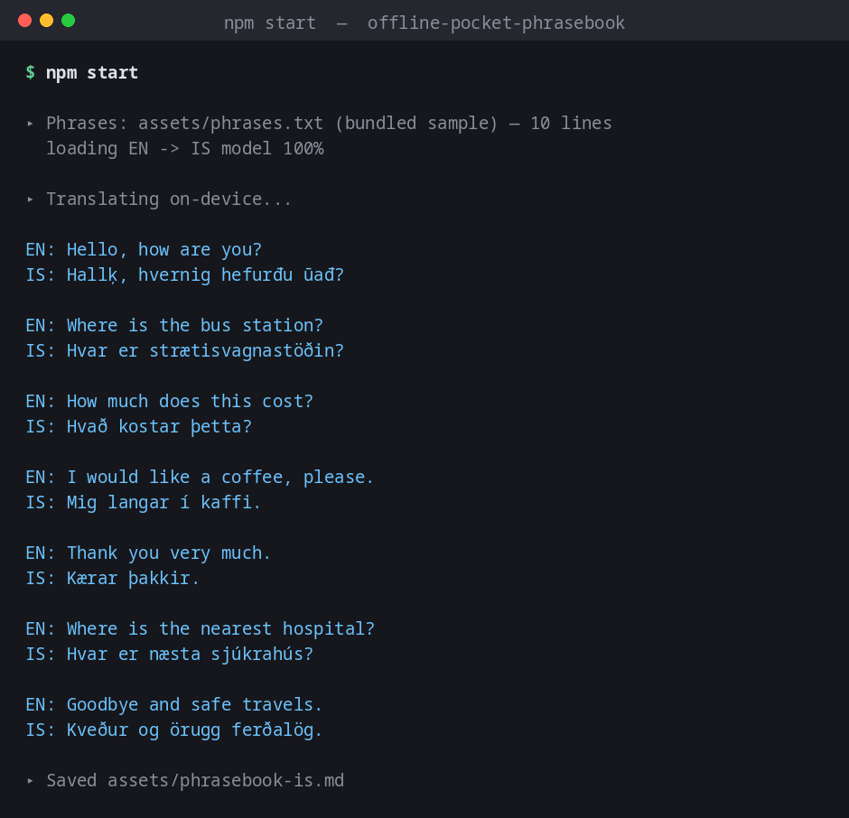

# Offline Pocket Phrasebook

A CLI that turns a list of English phrases into an English → Icelandic pocket phrasebook — entirely **on-device**, powered by [Tether's QVAC SDK](https://github.com/tetherto/qvac).

No API key. No usage bill. Nothing you type leaves your machine.



## What it does / which QVAC function it calls

Give it a text file with one English phrase per line and it translates each one into Icelandic, printing them and saving a Markdown table you can keep on your phone for a trip. It calls QVAC's `loadModel()` to load a [Bergamot](https://browser.mt/) neural machine translation model (`BERGAMOT_EN_IS`) and `translate()` to run each phrase locally.

## Why I built it

Icelandic has around 350,000 speakers, so it's a genuinely low-resource language for machine translation compared to French or Spanish — most translation apps handle it poorly or not at all offline. This batch-translates a whole phrasebook in one run with a small (~35 MB) local model, so a traveler could generate and save a phrasebook before a trip with no connectivity required once it's built.

## Requirements

- Node.js 18+
- ~35 MB free disk (translation model, downloaded once and cached)

## Install

```bash
git clone https://github.com/Nafree1/qvac-phrasebook.git
cd qvac-phrasebook
npm install
```

SDK used: **`@qvac/sdk` `^0.19.1`** (tested against `0.19.1`).

## Run

Build a phrasebook from the bundled sample phrases:

```bash
npm start
```

Build one from your own list (one English phrase per line):

```bash
node src/index.js /path/to/phrases.txt /path/to/output.md
```

```
▸ Phrases: assets/phrases.txt (bundled sample) — 10 lines
  loading EN -> IS model 100%

▸ Translating on-device...

EN: Where is the bus station?
IS: Hvar er strætisvagnastöðin?

EN: How much does this cost?
IS: Hvað kostar þetta?
...
▸ Saved assets/phrasebook-is.md
```

The first run downloads the model (~35 MB) and shows a progress bar; every run after that is instant and fully offline since the model is cached on disk.

**Small-model honesty:** one phrase in the bundled sample — "Hello, how are you?" — consistently comes back with mangled accented characters (`Hallķ, hvernig hefurđu ūađ?` instead of the correct `Halló, hvernig hefurðu það?`), reproducible across repeated runs. Every other phrase, including ones with the same Icelandic letters (þ, ð, ó) in different words, translates with correct accents. This looks like a genuine quirk in how this specific small Bergamot model encodes that particular sequence, not a bug in this app — it's left in rather than edited out, since the point of this submission is showing what actually runs, warts included.

## How it works

- `src/index.js` — the whole app. Reads the phrase list, loads `BERGAMOT_EN_IS`, calls `translate()` once per phrase, and writes a Markdown table of English/Icelandic pairs.
- `assets/phrases.txt` — ten short, original sample travel phrases.
- `qvac.config.json` — quiets the SDK's own console logging so the CLI output stays readable.

## License

MIT, see [LICENSE](./LICENSE).
